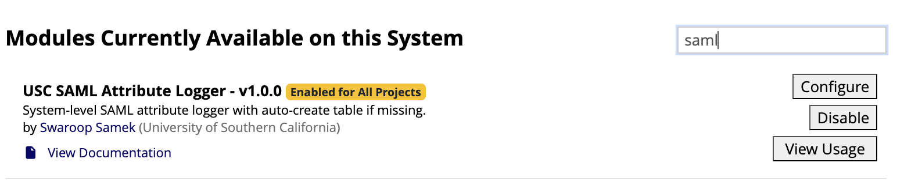
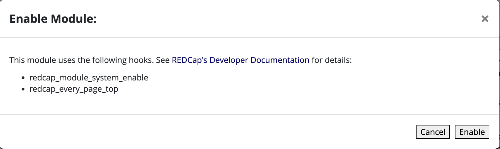
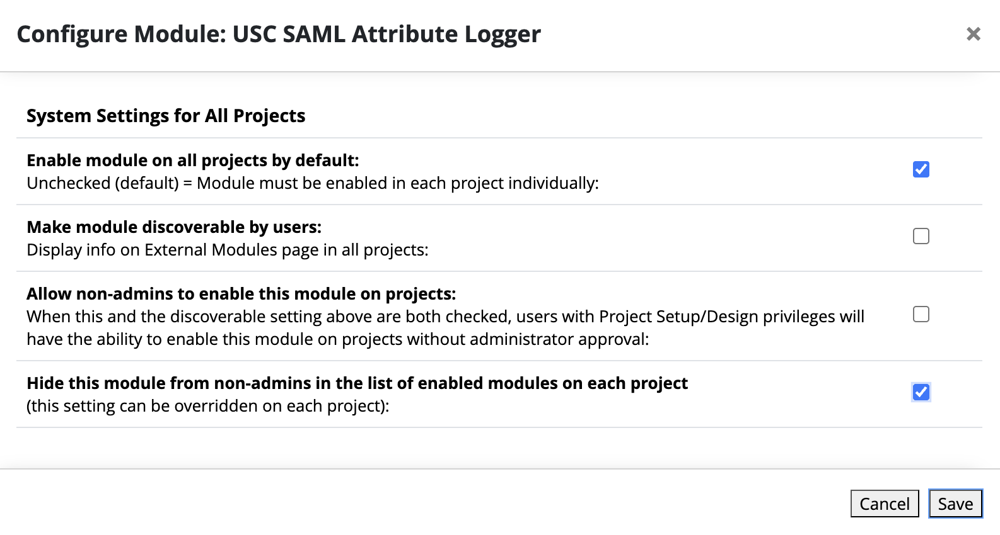

# USC SAML Attribute Logger (v1.0.0)

System-level SAML attribute logger.

## Design Goals

- Capture SAML authentication attributes in a database table
- No migrations
- No schema changes once table exists
- Matches original working schema exactly
- Auto-creates table only if missing
- Stable

## Table Schema

The module creates the following table IF it does not exist:

	saml_attributes (
		id BIGINT UNSIGNED AUTO_INCREMENT PRIMARY KEY,
		firstname VARCHAR(255),
		lastname VARCHAR(255),
		email VARCHAR(255),
		pvid VARCHAR(255),
		netid VARCHAR(255),
		uscid VARCHAR(255),
		role VARCHAR(255),
		client_ip VARCHAR(45),
		timestamp DATETIME DEFAULT CURRENT_TIMESTAMP
	)

If the table already exists:
- No changes are made
- No columns are added
- No data is modified

## Behavior

- Uses redcap_every_page_top()
- Logs once per session
- Uses prepared statements
- Does not modify REDCap core files
- Hidden system-level module

## Installation

1. Place folder in:
   redcap/modules/usc_saml_attribute_logger_v1.0.0

2. Ensure Apache can read files

3. Enable system-wide in Control Center → External Modules

## Maintainer

Swaroop Samek
University of Southern California
ssamek@usc.edu
